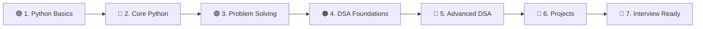
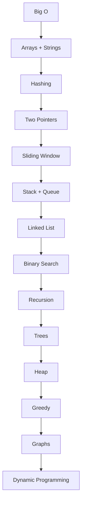
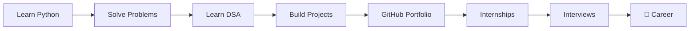

# 🐍 Python-Hareesh

> **My journey from Python beginner → problem solver → DSA-ready
> developer.**

This repository is designed to be more than a collection of Python
programs. It is a **step-by-step learning map** for anyone who wants to
learn Python from scratch and gradually move into **Data Structures &
Algorithms (DSA), problem solving, projects, and interview
preparation**.

If you are a complete beginner, **follow the order below instead of
trying to learn everything at once.**

------------------------------------------------------------------------

## 🧭 The Easiest Path



### The rule

**Learn → Code → Practice → Build → Revise → Repeat**

Don't spend months only watching tutorials. After every concept, write
code.

------------------------------------------------------------------------

# 🗺️ Complete Python + DSA Roadmap

``` text
PYTHON
│
├── 01. Setup & Syntax
│   ├── Python installation
│   ├── VS Code / IDE
│   ├── print()
│   ├── comments
│   └── basic input/output
│
├── 02. Python Fundamentals
│   ├── Variables
│   ├── Data Types
│   ├── Operators
│   ├── Strings
│   ├── Type Casting
│   └── Input / Output
│
├── 03. Control Flow
│   ├── if / elif / else
│   ├── for loops
│   ├── while loops
│   ├── break / continue
│   └── nested loops
│
├── 04. Data Structures
│   ├── Lists
│   ├── Tuples
│   ├── Sets
│   ├── Dictionaries
│   └── Comprehensions
│
├── 05. Functions
│   ├── Parameters
│   ├── Return values
│   ├── Scope
│   ├── *args / **kwargs
│   ├── Lambda
│   └── Recursion
│
├── 06. Intermediate Python
│   ├── Modules & packages
│   ├── Exceptions
│   ├── File handling
│   ├── JSON
│   ├── Iterators
│   ├── Generators
│   ├── Decorators
│   └── Virtual environments
│
├── 07. OOP
│   ├── Classes & objects
│   ├── Constructors
│   ├── Encapsulation
│   ├── Inheritance
│   ├── Polymorphism
│   └── Abstraction
│
└── 08. Python for Development
    ├── APIs
    ├── Git & GitHub
    ├── Testing
    ├── SQL basics
    └── Project structure


DSA
│
├── 01. Complexity
│   ├── Big O
│   ├── Time complexity
│   └── Space complexity
│
├── 02. Arrays & Strings
├── 03. Hashing
├── 04. Two Pointers
├── 05. Sliding Window
├── 06. Stack
├── 07. Queue / Deque
├── 08. Linked List
├── 09. Binary Search
├── 10. Recursion
├── 11. Backtracking
├── 12. Trees
├── 13. Binary Search Trees
├── 14. Heap / Priority Queue
├── 15. Greedy
├── 16. Graphs
├── 17. Dynamic Programming
└── 18. Advanced Algorithms
```

------------------------------------------------------------------------

# 🟢 LEVEL 0 --- Setup

### Install

-   Python 3
-   VS Code
-   Git
-   GitHub account

Useful links:

-   [Python Official Website](https://www.python.org/)
-   [Python Documentation](https://docs.python.org/3/)
-   [VS Code](https://code.visualstudio.com/)
-   [Git](https://git-scm.com/)
-   [GitHub](https://github.com/)

### First program

``` python
print("Hello, World!")
```

Then learn:

``` python
name = input("Enter your name: ")
age = int(input("Enter your age: "))

print(f"Hello {name}, you are {age} years old.")
```

### ✅ Beginner checkpoint

You should be able to:

-   Run a Python file
-   Take input
-   Print output
-   Create variables
-   Understand basic errors

------------------------------------------------------------------------

# 🟢 LEVEL 1 --- Python Fundamentals

## 1. Variables & Data Types

Learn:

-   `int`
-   `float`
-   `str`
-   `bool`
-   `None`
-   Type conversion

``` python
age = 20
height = 5.9
name = "Hareesh"
is_student = True
```

Practice:

-   Simple calculator
-   Temperature converter
-   Age calculator
-   Currency/unit converter

------------------------------------------------------------------------

## 2. Operators

Learn:

``` text
Arithmetic     + - * / // % **
Comparison     == != > < >= <=
Logical        and or not
Assignment     = += -= *= /=
Membership     in / not in
Identity       is / is not
```

------------------------------------------------------------------------

## 3. Strings

Learn:

-   Indexing
-   Slicing
-   String methods
-   Formatting
-   f-strings

``` python
text = "Python"

print(text[0])
print(text[-1])
print(text[1:4])
print(text.upper())
```

Practice:

-   Reverse a string
-   Count vowels
-   Palindrome checker
-   Character frequency

------------------------------------------------------------------------

# 🟢 LEVEL 2 --- Control Flow

## Conditions

``` python
marks = 85

if marks >= 90:
    grade = "A+"
elif marks >= 75:
    grade = "A"
else:
    grade = "B"

print(grade)
```

## Loops

Master:

-   `for`
-   `while`
-   `range()`
-   nested loops
-   `break`
-   `continue`

Practice:

-   Multiplication table
-   Prime number checker
-   Factorial
-   Fibonacci
-   Number patterns
-   Armstrong number
-   Palindrome number

### 🔥 Important

**Don't just memorize patterns. Understand how the loop moves through
the problem.**

------------------------------------------------------------------------

# 🔵 LEVEL 3 --- Python Data Structures

## Lists

``` python
numbers = [10, 20, 30, 40]

numbers.append(50)
numbers.remove(20)

print(numbers)
```

Master:

-   Indexing
-   Slicing
-   `append`
-   `insert`
-   `remove`
-   `pop`
-   `sort`
-   `reverse`
-   `count`
-   `index`

------------------------------------------------------------------------

## Tuples

``` python
point = (10, 20)
```

Understand:

-   Immutable data
-   Tuple unpacking
-   When tuples are useful

------------------------------------------------------------------------

## Sets

``` python
numbers = {1, 2, 2, 3}
print(numbers)  # {1, 2, 3}
```

Master:

-   Union
-   Intersection
-   Difference
-   Membership

------------------------------------------------------------------------

## Dictionaries

``` python
student = {
    "name": "Hareesh",
    "age": 20,
    "branch": "CSE"
}

print(student["name"])
```

Master:

-   Keys / values
-   `get()`
-   `items()`
-   `keys()`
-   `values()`
-   Updating dictionaries
-   Nested dictionaries

### ⭐ Very important for DSA

**Lists + Dictionaries + Sets are the foundation of Python DSA.**

------------------------------------------------------------------------

# 🟣 LEVEL 4 --- Functions

Learn:

``` python
def add(a, b):
    return a + b
```

Then progress to:

``` text
Functions
   ↓
Parameters
   ↓
Return values
   ↓
Scope
   ↓
Lambda
   ↓
*args / **kwargs
   ↓
Recursion
```

Practice writing small functions instead of putting everything inside
one huge program.

------------------------------------------------------------------------

# 🟣 LEVEL 5 --- Intermediate Python

Once the fundamentals feel comfortable, learn:

### Modules

``` python
import math
import random
```

### Exception handling

``` python
try:
    x = int(input("Enter a number: "))
except ValueError:
    print("Invalid input")
```

### File handling

``` python
with open("data.txt", "r") as file:
    data = file.read()
```

### Also learn

-   JSON
-   `pathlib`
-   Iterators
-   Generators
-   Decorators
-   List / dictionary / set comprehensions
-   Virtual environments
-   Package installation with `pip`

------------------------------------------------------------------------

# 🟣 LEVEL 6 --- Object-Oriented Programming

Learn OOP **after you are comfortable with functions and data
structures.**

Order:

``` text
Class
 ↓
Object
 ↓
__init__
 ↓
Instance variables
 ↓
Methods
 ↓
Encapsulation
 ↓
Inheritance
 ↓
Polymorphism
 ↓
Abstraction
```

Example:

``` python
class Student:
    def __init__(self, name, marks):
        self.name = name
        self.marks = marks

    def display(self):
        print(self.name, self.marks)


student = Student("Hareesh", 90)
student.display()
```

### Mini projects

-   Bank account
-   Student management system
-   Library management system
-   Quiz application
-   Inventory manager

------------------------------------------------------------------------

# 🧠 LEVEL 7 --- Start DSA

**Do NOT start DSA before you know:**

-   Variables
-   Conditions
-   Loops
-   Functions
-   Lists
-   Dictionaries
-   Sets
-   Strings
-   Basic recursion

You don't need advanced Python before starting DSA.

------------------------------------------------------------------------

# ⏱️ DSA 0 --- Big O

First understand:

``` text
O(1)       Constant
O(log n)   Logarithmic
O(n)       Linear
O(n log n) Linearithmic
O(n²)      Quadratic
O(2ⁿ)      Exponential
```

Example:

``` python
# O(n)
for x in numbers:
    print(x)
```

``` python
# O(n²)
for i in numbers:
    for j in numbers:
        print(i, j)
```

Always ask:

> **How much time and memory does this solution use?**

------------------------------------------------------------------------

# 🔴 DSA 1 --- Arrays & Strings

Learn:

-   Traversal
-   Searching
-   Min / max
-   Prefix sums
-   Subarrays
-   Frequency counting
-   Kadane's algorithm
-   String manipulation

### Problems to practice

``` text
Find maximum element
Find second largest
Reverse array
Remove duplicates
Move zeroes
Rotate array
Maximum subarray
Two Sum
Best Time to Buy/Sell Stock
Valid Anagram
Valid Palindrome
```

------------------------------------------------------------------------

# 🔴 DSA 2 --- Hashing

Python tools:

``` python
set()
dict()
collections.Counter
collections.defaultdict
```

Learn:

-   Frequency maps
-   Duplicate detection
-   Fast lookup
-   Counting patterns

Typical complexity:

``` text
Average dictionary lookup → O(1)
Average set lookup        → O(1)
```

------------------------------------------------------------------------

# 🔴 DSA 3 --- Two Pointers

Pattern:

``` text
left  →→
right ←←
```

Use it for:

-   Sorted arrays
-   Pair problems
-   Palindromes
-   Removing duplicates
-   Partitioning

------------------------------------------------------------------------

# 🔴 DSA 4 --- Sliding Window

Pattern:

``` text
[ L ........ R ]
```

Learn:

-   Fixed-size window
-   Variable-size window
-   Frequency tracking

Practice:

-   Maximum sum subarray
-   Longest substring without repeating characters
-   Minimum window style problems

------------------------------------------------------------------------

# 🔴 DSA 5 --- Stack & Queue

## Stack

``` python
stack = []

stack.append(10)
stack.append(20)
stack.pop()
```

Think:

**LIFO --- Last In, First Out**

Applications:

-   Parentheses
-   Undo
-   Monotonic stack
-   Expression problems

## Queue

``` python
from collections import deque

q = deque()
q.append(10)
q.append(20)
q.popleft()
```

Think:

**FIFO --- First In, First Out**

Applications:

-   BFS
-   Scheduling
-   Buffers

------------------------------------------------------------------------

# 🔴 DSA 6 --- Linked Lists

Learn:

``` text
Node
 ↓
Next
 ↓
Node
 ↓
Node
```

Master:

-   Traversal
-   Insert
-   Delete
-   Reverse
-   Fast & slow pointers
-   Cycle detection
-   Merge linked lists

Important problems:

-   Reverse Linked List
-   Middle of Linked List
-   Linked List Cycle
-   Merge Two Sorted Lists
-   Remove Nth Node

------------------------------------------------------------------------

# 🔴 DSA 7 --- Binary Search

Learn binary search until you can recognize it without thinking.

Basic idea:

``` text
left       mid       right
  |---------|---------|
           ↓
       eliminate half
```

Complexity:

``` text
O(log n)
```

Master:

-   Search in sorted array
-   First / last occurrence
-   Lower bound
-   Upper bound
-   Search on answer

------------------------------------------------------------------------

# 🔴 DSA 8 --- Recursion & Backtracking

Before advanced trees/graphs, understand recursion.

Learn:

``` text
Base case
Recursive case
Call stack
```

Then:

-   Subsets
-   Permutations
-   Combinations
-   N-Queens
-   Maze problems

------------------------------------------------------------------------

# 🔴 DSA 9 --- Trees

Learn in this order:

``` text
Tree
 ↓
Binary Tree
 ↓
DFS
 ├── Preorder
 ├── Inorder
 └── Postorder
 ↓
BFS / Level Order
 ↓
Binary Search Tree
```

Practice:

-   Maximum depth
-   Invert tree
-   Same tree
-   Level order traversal
-   Diameter
-   Lowest common ancestor

------------------------------------------------------------------------

# 🔴 DSA 10 --- Heap / Priority Queue

Python:

``` python
import heapq
```

Learn:

-   Min heap
-   Max heap concept
-   Top K problems
-   Kth largest/smallest
-   Merge K sorted structures

------------------------------------------------------------------------

# 🔴 DSA 11 --- Greedy

Learn how to identify situations where a locally optimal decision can
lead to a globally optimal solution.

Practice:

-   Activity selection
-   Jump Game
-   Gas Station
-   Interval problems
-   Scheduling problems

------------------------------------------------------------------------

# 🔴 DSA 12 --- Graphs

Learn:

``` text
Graph
 ↓
Representation
 ├── Adjacency List
 └── Adjacency Matrix
 ↓
DFS
 ↓
BFS
 ↓
Connected Components
 ↓
Cycle Detection
 ↓
Shortest Paths
 ↓
Topological Sort
```

Then:

-   Dijkstra
-   Union Find / DSU
-   Minimum Spanning Tree
-   Bellman-Ford
-   Floyd-Warshall

------------------------------------------------------------------------

# 🔴 DSA 13 --- Dynamic Programming

**Don't start DP too early.**

First become comfortable with:

-   Recursion
-   Arrays
-   Hashing
-   Trees
-   Graph thinking

Then learn:

``` text
Recursion
   ↓
Memoization
   ↓
Tabulation
   ↓
Space Optimization
```

Core patterns:

-   1D DP
-   2D DP
-   Knapsack
-   Subsequence
-   Grid DP
-   String DP
-   Interval DP

------------------------------------------------------------------------

# 📊 The DSA Progression



------------------------------------------------------------------------

# 🧩 How To Solve Any DSA Problem

Don't immediately search for the answer.

Use this process:

``` text
1. Understand the problem
        ↓
2. Write examples
        ↓
3. Identify input/output
        ↓
4. Think of brute force
        ↓
5. Find the bottleneck
        ↓
6. Choose a data structure / pattern
        ↓
7. Optimize
        ↓
8. Code
        ↓
9. Test edge cases
        ↓
10. Analyze Big O
        ↓
11. Review the solution
```

### The 20-minute rule

If you are stuck:

**0--10 min:** understand and try\
**10--20 min:** try another approach\
**20+ min:** study the solution\
**Then:** close it and implement it yourself

The goal is not to solve every problem without help.

The goal is to **learn the pattern**.

------------------------------------------------------------------------

# 🧠 DSA Pattern Cheat Sheet

  If you see...                      Think...
  ---------------------------------- ------------------------------
  Sorted array                       Binary Search / Two Pointers
  Pair / triplet                     Hashing / Two Pointers
  Contiguous subarray                Sliding Window / Prefix Sum
  Frequency                          HashMap / Counter
  Matching brackets                  Stack
  Next greater element               Monotonic Stack
  Linked list cycle                  Fast & Slow Pointers
  Tree traversal                     DFS / BFS
  Shortest unweighted path           BFS
  Shortest weighted path             Dijkstra
  Dependencies                       Topological Sort
  Repeated overlapping subproblems   Dynamic Programming
  Top K                              Heap
  All combinations                   Backtracking
  Connected components               DFS / BFS / DSU

------------------------------------------------------------------------

# 🛠️ Projects --- Learn by Building

Do not wait until you "finish Python" before building projects.

## 🟢 Beginner

Build:

-   Calculator
-   Number guessing game
-   To-do CLI
-   Quiz game
-   Password generator
-   Unit converter
-   Contact book

## 🔵 Intermediate

Build:

-   Expense tracker
-   File organizer
-   Weather CLI
-   Web scraper
-   Student management system
-   Library management system
-   REST API client

## 🟣 Advanced

Build:

-   FastAPI backend
-   Authentication system
-   Database-backed application
-   Task management API
-   Recommendation system
-   Data analysis project
-   Automation tool

### Project rule

Every project should teach you at least **one new concept**.

------------------------------------------------------------------------

# 🌐 After Python + DSA

Once the core is strong, choose a direction.

``` text
Python + DSA
      │
      ├── ☁️ Cloud / DevOps
      │    ├── Linux
      │    ├── Networking
      │    ├── Docker
      │    ├── AWS / Azure / GCP
      │    └── CI/CD
      │
      ├── 🌐 Backend
      │    ├── FastAPI / Django
      │    ├── REST APIs
      │    ├── SQL
      │    ├── Docker
      │    └── System Design
      │
      ├── 🤖 AI / ML
      │    ├── NumPy
      │    ├── Pandas
      │    ├── Statistics
      │    ├── Scikit-learn
      │    └── Deep Learning
      │
      └── 📊 Data
           ├── SQL
           ├── Pandas
           ├── Visualization
           └── Data Analytics
```

------------------------------------------------------------------------

# 📚 Recommended Learning Resources

### Python

-   [Python Official Tutorial](https://docs.python.org/3/tutorial/)
-   [Python Documentation](https://docs.python.org/3/)
-   [Real Python](https://realpython.com/)

### DSA

-   [LeetCode](https://leetcode.com/)
-   [GeeksforGeeks](https://www.geeksforgeeks.org/)
-   [HackerRank](https://www.hackerrank.com/)
-   [NeetCode](https://neetcode.io/)

### Roadmaps

-   [roadmap.sh --- Python](https://roadmap.sh/python)
-   [roadmap.sh --- Computer
    Science](https://roadmap.sh/computer-science)
-   [roadmap.sh --- Data Structures &
    Algorithms](https://roadmap.sh/datastructures-and-algorithms)

------------------------------------------------------------------------

# 🗺️ Roadmap Visuals

### Python Roadmap

[](https://roadmap.sh/python)

### DSA Roadmap

[](https://roadmap.sh/datastructures-and-algorithms)

> If an external roadmap image changes or does not render, use the
> roadmap links above. The learning sequence in this README is
> intentionally simplified for beginners.

------------------------------------------------------------------------

# 🏆 Practice Strategy

## Phase 1 --- Python

``` text
Learn concept
↓
Write 5 small programs
↓
Solve 5 easy problems
↓
Move on
```

## Phase 2 --- DSA

For each topic:

``` text
Understand concept
↓
Learn the pattern
↓
Implement from scratch
↓
Solve Easy problems
↓
Solve Medium problems
↓
Review mistakes
```

### Recommended progression

``` text
Easy
 ↓
Easy
 ↓
Easy
 ↓
Medium
 ↓
Medium
 ↓
Hard only when necessary
```

**Don't chase problem counts. Chase understanding.**

------------------------------------------------------------------------

# 📈 My Progress Tracker

## Python

-   [ ] Setup & syntax
-   [ ] Variables & data types
-   [ ] Operators
-   [ ] Strings
-   [ ] Conditions
-   [ ] Loops
-   [ ] Lists
-   [ ] Tuples
-   [ ] Sets
-   [ ] Dictionaries
-   [ ] Functions
-   [ ] Recursion
-   [ ] Modules
-   [ ] Exceptions
-   [ ] File handling
-   [ ] JSON
-   [ ] Comprehensions
-   [ ] Iterators & generators
-   [ ] Decorators
-   [ ] OOP
-   [ ] APIs
-   [ ] Testing
-   [ ] Git & GitHub

## DSA

-   [ ] Big O
-   [ ] Arrays
-   [ ] Strings
-   [ ] Hashing
-   [ ] Two Pointers
-   [ ] Sliding Window
-   [ ] Stack
-   [ ] Queue
-   [ ] Linked List
-   [ ] Binary Search
-   [ ] Recursion
-   [ ] Backtracking
-   [ ] Trees
-   [ ] BST
-   [ ] Heap
-   [ ] Greedy
-   [ ] Graphs
-   [ ] Shortest Paths
-   [ ] DSU
-   [ ] Topological Sort
-   [ ] Dynamic Programming

## Development

-   [ ] Git
-   [ ] GitHub
-   [ ] Linux basics
-   [ ] SQL
-   [ ] REST APIs
-   [ ] Docker
-   [ ] Testing
-   [ ] Deployment
-   [ ] 3+ projects

------------------------------------------------------------------------

# 📅 Simple Daily Routine

You do **not** need 8 hours every day.

### If you have 2 hours:

``` text
30 min → Learn Python / DSA concept
60 min → Solve problems
20 min → Build / implement
10 min → Revise notes
```

### If you have 1 hour:

``` text
20 min → Learn
30 min → Practice
10 min → Review
```

### Most important rule

> **Consistency beats intensity.**

One problem every day for months is better than solving 30 problems once
and disappearing for two weeks.

------------------------------------------------------------------------

# 📝 How to Maintain This Repository

Use a structure like:

``` text
Python-Hareesh/
│
├── 01_Basics/
├── 02_Control_Flow/
├── 03_Data_Structures/
├── 04_Functions/
├── 05_OOP/
├── 06_Intermediate_Python/
│
├── DSA/
│   ├── 01_Arrays/
│   ├── 02_Strings/
│   ├── 03_Hashing/
│   ├── 04_Two_Pointers/
│   ├── 05_Sliding_Window/
│   ├── 06_Stack/
│   ├── 07_Queue/
│   ├── 08_Linked_List/
│   ├── 09_Binary_Search/
│   ├── 10_Recursion/
│   ├── 11_Trees/
│   ├── 12_Heap/
│   ├── 13_Greedy/
│   ├── 14_Graphs/
│   └── 15_Dynamic_Programming/
│
├── Projects/
│   ├── Beginner/
│   ├── Intermediate/
│   └── Advanced/
│
└── README.md
```

------------------------------------------------------------------------

# 🚀 Beginner's Exact Starting Point

If you are seeing this repository for the first time, **start here:**

### Week 1

``` text
Day 1 → Variables + Data Types
Day 2 → Operators + Input/Output
Day 3 → Conditions
Day 4 → for / while loops
Day 5 → Strings
Day 6 → Lists
Day 7 → Practice + Revision
```

### Week 2

``` text
Day 8  → Tuples + Sets
Day 9  → Dictionaries
Day 10 → Functions
Day 11 → Functions practice
Day 12 → Recursion basics
Day 13 → Mixed problems
Day 14 → Mini project
```

### Week 3+

``` text
Intermediate Python
       ↓
OOP
       ↓
Big O
       ↓
Arrays + Strings
       ↓
Hashing
       ↓
Two Pointers
       ↓
Sliding Window
       ↓
Stack + Queue
       ↓
Linked List
       ↓
Binary Search
       ↓
Trees
       ↓
Heap
       ↓
Graphs
       ↓
Dynamic Programming
```

------------------------------------------------------------------------

# 🎯 The Final Goal

The goal is **not**:

> "I completed a Python course."

The goal is:

> **"I can look at a problem, understand it, choose an approach, write
> clean Python code, analyze its complexity, and build something useful
> with it."**



------------------------------------------------------------------------

## ⭐ Repository Philosophy

> **Don't learn everything. Learn what you need, practice it, and build
> with it.**

This repository is my public learning log --- mistakes, solutions,
projects, and progress included.

If you're also learning Python:

**Fork it → Follow the roadmap → Practice → Build → Keep going.**

------------------------------------------------------------------------

### 👨‍💻 Author

**Hareesh Reddy**

📌 Learning Python • DSA • Problem Solving • Development

⭐ If this roadmap helps you, consider starring the repository.
